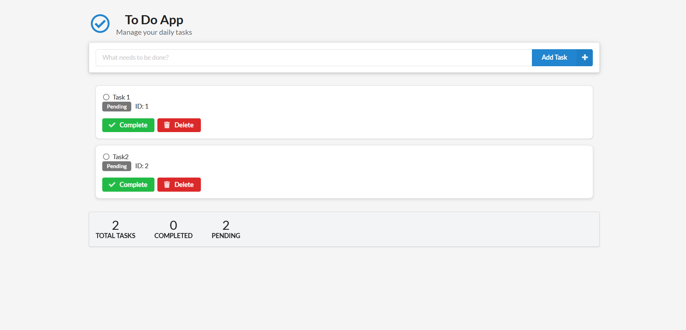
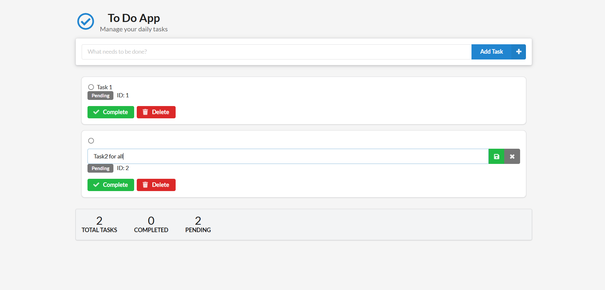

# 📝 Todo App

A simple and elegant Todo web application built with **Flask**, **SQLAlchemy**, and **Semantic UI**. This app lets you add, edit, complete, and delete tasks to help manage your daily productivity.

---

## 🚀 Features

- ✅ Add new tasks  
- ✏️ Edit task titles in place  
- ✔️ Mark tasks as completed or reopen them  
- 🗑️ Delete tasks  
- 📊 View stats: total, completed, and pending tasks  
- ✨ Smooth UI interactions with Semantic UI

---

## 🛠️ Technologies Used

- [Python](https://www.python.org/) + [Flask](https://flask.palletsprojects.com/)
- [SQLite](https://www.sqlite.org/index.html) with SQLAlchemy ORM
- [Semantic UI](https://semantic-ui.com/) for responsive styling
- JavaScript (vanilla) for interactivity

---

## 📸 Screenshots

| Main View | Edit Mode |
|-----------|-----------|
|  |  |

*(Replace with actual screenshots of your app.)*

---

## 🧑‍💻 Setup Instructions

1. **Clone the repository**
   ```bash
   git clone https://github.com/your-username/todo-flask-app.git
   cd todo-flask-app
   ```

2. **Create a virtual environment and activate it**
   ```bash
   python -m venv venv
   source venv/bin/activate  # On Windows use `venv\Scripts\activate`
   ```

3. **Install dependencies**
   ```bash
   pip install -r requirements.txt
   ```

4. **Run the app**
   ```bash
   python app.py
   ```

5. **Open in browser**
   Visit [http://127.0.0.1:5000](http://127.0.0.1:5000) to see it in action.

---

## 📁 Project Structure

```
todo-flask-app/
│
├── app.py                  # Main Flask app
├── db.sqlite               # SQLite database (auto-generated)
├── templates/
│   └── base.html           # HTML template
├── static/                 # (Optional) Static files (CSS/JS if customized)
├── requirements.txt        # Python dependencies
└── README.md               # This file
```

---

## 📦 Dependencies

Here are the core dependencies (add them in `requirements.txt`):

```txt
Flask
Flask-SQLAlchemy
```

---

## 🧹 To Do

- Add user authentication (login/register)
- Add due dates and reminders
- Filter/sort/search tasks
- Store data in PostgreSQL (for production use)

---

## 📄 License

MIT License. See `LICENSE` file for details.

---

## 🙌 Acknowledgments

- UI inspired by [Semantic UI](https://semantic-ui.com/)
- Flask documentation and community for guidance
